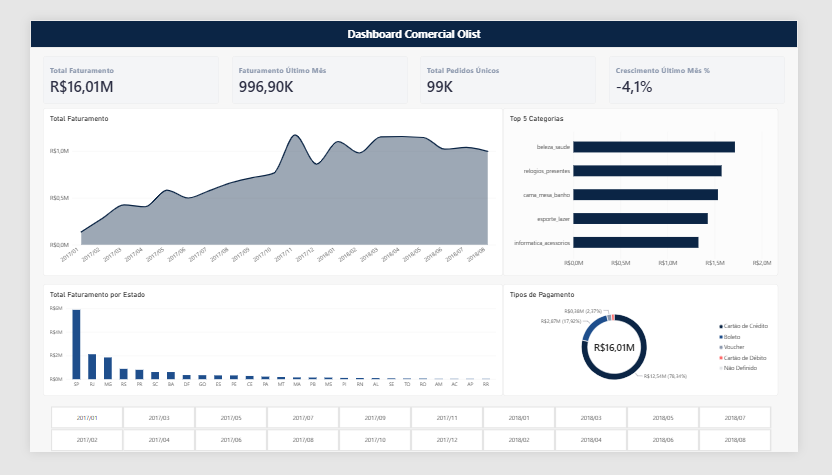

# 📊 Dashboard de Análise Comercial – E-commerce Olist

Dashboard interativo desenvolvido no **Power BI** para analisar o desempenho comercial de uma operação de e-commerce brasileiro, com base no dataset público da **Olist** (100k+ pedidos, 2016–2018).



---

## 🎯 Visão Geral do Projeto

Este projeto simula uma demanda real de negócio: transformar dados brutos de transações de vendas em um painel interativo capaz de responder às principais perguntas estratégicas da diretoria de uma empresa de e-commerce:

- Qual foi o faturamento total, número de pedidos e a evolução mensal das vendas?
- Quais categorias de produtos mais geram receita?
- Como o faturamento se distribui geograficamente pelos estados brasileiros?
- Qual a participação de cada método de pagamento no total de vendas?

---

## 💡 Insights Chave Encontrados

- **Faturamento Total:** R$ 16,01 milhões no período analisado.
- **Faturamento do Último Mês:** R$ 996,90 mil, com uma retração de **-4,1%** em relação ao mês anterior (indicando um ponto de atenção para a diretoria).
- **Total de Pedidos Únicos:** 99 mil pedidos processados no período.
- **Top Categoria:** *Beleza & Saúde* lidera o ranking de faturamento, seguida por *Relógios & Presentes* e *Cama, Mesa & Banho*.
- **Concentração Geográfica:** São Paulo (SP) é disparadamente o estado com maior volume de faturamento, seguido por Rio de Janeiro (RJ) e Minas Gerais (MG) — reforçando a concentração de vendas no eixo Sudeste.
- **Meio de Pagamento:** Cartão de Crédito representa **76,9%** de todas as transações, seguido por Boleto (17,9%), com Voucher e Cartão de Débito tendo participação marginal.

---

## 🛠️ Tecnologias e Etapas Utilizadas

### 1. Excel
Utilizado na etapa inicial para validação rápida e inspeção exploratória dos arquivos CSV brutos (`olist_orders_dataset.csv`, `olist_order_payments_dataset.csv`, `olist_products_dataset.csv`) antes da carga no Power BI.

### 2. Power Query (ETL)
Toda a limpeza e transformação dos dados foi feita no Power Query Editor do Power BI:
- **Ajuste de tipos de dados:** colunas de valor formatadas como Número Decimal Fixo (Moeda) e colunas de data como Data/Hora.
- **Tratamento de nulos:** pedidos com status "Cancelado" ou "Indisponível" foram filtrados para considerar apenas vendas efetivadas; categorias nulas foram substituídas por "Não Especificado".
- **Colunas calculadas:** criação de coluna de faturamento total (`Quantidade x Preço Unitário + Frete`) quando não disponível diretamente na base.
- **Mesclagem de tabelas (joins):** junção da tabela de pedidos com a tabela de produtos/categorias via `product_id`, trazendo nomes legíveis para as categorias.

### 3. Modelagem de Dados
- Relacionamento em esquema estrela (*star schema*), com a tabela fato de vendas conectada às tabelas dimensão (Produtos, Clientes, Pagamentos) na cardinalidade 1:*.
- Criação de uma tabela calendário dedicada (`d_Calendario`) para permitir análises temporais consistentes:
```dax
d_Calendario = CALENDAR(MIN(fVendas[Data_Pedido]), MAX(fVendas[Data_Pedido]))
```

### 4. DAX (Data Analysis Expressions)
Medidas centralizadas em uma tabela `_Medidas`:

```dax
Total Faturamento = SUM(fVendas[Valor_Total])

Total Pedidos = DISTINCTCOUNT(fVendas[ID_Pedido])

Ticket Médio = DIVIDE([Total Faturamento], [Total Pedidos], 0)

Faturamento Mes Anterior = 
CALCULATE([Total Faturamento], DATEADD(d_Calendario[Date], -1, MONTH))

Crescimento MoM % = 
DIVIDE([Total Faturamento] - [Faturamento Mes Anterior], [Faturamento Mes Anterior], 0)
```

### 5. Design e Visualização
- Layout de página única seguindo hierarquia visual: cartões de KPI no topo, gráfico de evolução temporal no centro, e gráficos de categorias/estado/pagamento na parte inferior.
- Paleta de cores sóbria (azul-marinho como cor dominante, cinza claro para fundo), sem poluição visual desnecessária.

---

## 📂 Estrutura do Repositório

```
├── /data          → Amostra da base de dados utilizada (Olist)
├── /dashboard      → Arquivo .pbix do Power BI
├── /img            → Capturas de tela e GIF demonstrativo do relatório
└── README.md
```

---

## 🚀 Como Visualizar o Dashboard

1. Baixe o arquivo `.pbix` na pasta `/dashboard` e abra no Power BI Desktop (gratuito).
2. Ou acesse a versão publicada na web: **[Link para o relatório interativo]**

---

## 📌 Fonte dos Dados

[Brazilian E-Commerce Public Dataset by Olist](https://www.kaggle.com/datasets/olistbr/brazilian-ecommerce) — Kaggle.

---

## 👤 Autor

Desenvolvido como projeto de portfólio em Análise de Dados / Business Intelligence.

`#AnaliseDeDados #PowerBI #BusinessIntelligence #DataAnalytics #Portfolio`
